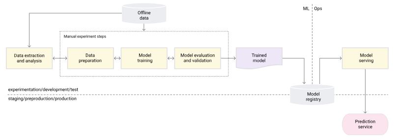
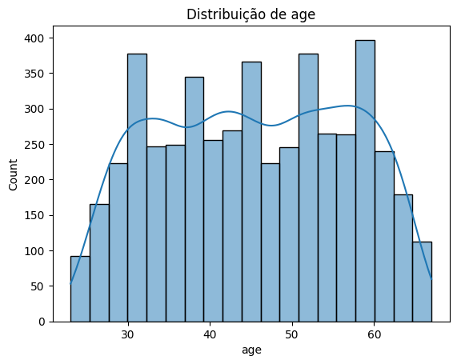
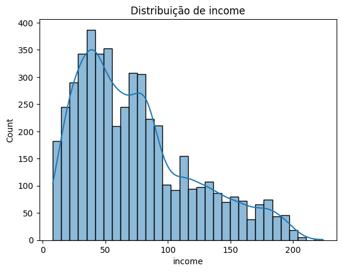
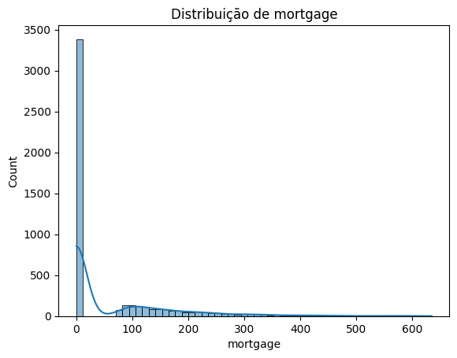
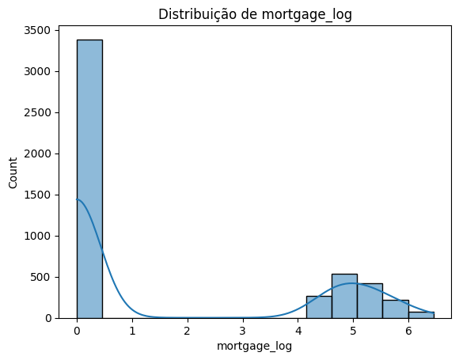

## Machine Learning I - Santander Coders 2024: Trilha de Ciência de Dados


### Sobre o Projeto

Este projeto visa desenvolver um sistema preditivo para auxiliar na avaliação de crédito. Utilizando algoritmos de Machine Learning, o projeto tem dois objetivos principais: prever o score de crédito de um cliente, em um problema de regressão, e construir um modelo de classificação para determinar a aprovação ou não de crédito para clientes específicos. Este projeto pode ajudar a tomar decisões mais rápidas e assertivas, reduzindo o risco de inadimplência e otimizando a alocação de crédito.



### O Conjunto de Dados

Os dados consistem em informações pessoais e financeiras dos clientes, detalhando características relevantes para avaliação de crédito. As principais colunas dos dados incluem:

```
<class 'pandas.core.frame.DataFrame'>
RangeIndex: 5000 entries, 0 to 4999
Data columns (total 14 columns):
 #   Column              Non-Null Count  Dtype  
---  ------              --------------  -----  
 0   ID                  5000 non-null   int64  
 1   Age                 5000 non-null   int64  
 2   Experience          5000 non-null   int64  
 3   Income              5000 non-null   int64  
 4   ZIP.Code            5000 non-null   int64  
 5   Family              5000 non-null   int64  
 6   CCAvg               5000 non-null   float64
 7   Education           5000 non-null   int64  
 8   Mortgage            5000 non-null   int64  
 9   Personal.Loan       5000 non-null   int64  
 10  Securities.Account  5000 non-null   int64  
 11  CD.Account          5000 non-null   int64  
 12  Online              5000 non-null   int64  
 13  CreditCard          5000 non-null   int64  
dtypes: float64(1), int64(13)
memory usage: 547.0 KB

```

### Problema de Negócio

O setor de crédito apresenta um risco significativo para instituições financeiras, que buscam minimizar a concessão de crédito para clientes de alto risco. O problema de negócio que este projeto pretende resolver é: como prever o score de crédito dos clientes e, com base nesse score e em outras variáveis, decidir se um cliente deve ou não receber aprovação de crédito. Uma avaliação de crédito mais precisa permite que a instituição tome decisões mais informadas e minimize o risco de inadimplência, além de melhorar a experiência dos clientes de baixo risco com um processo de aprovação mais ágil.

### Objetivos

1. **Decidir a Aprovação de Crédito**: Desenvolver um modelo de classificação que determine se um cliente deve ou não receber aprovação de crédito. Esse modelo será alimentado pelo score de crédito previsto e outras variáveis relevantes.

2. **Melhorar o Processo de Avaliação de Crédito**: Automatizar o processo de análise de crédito com base em dados históricos e algoritmos preditivos, permitindo decisões mais rápidas e embasadas para aprovação de crédito.

### Feature Engineering

Foram criadas novas features, mas no sentido de analisar dados. Não usaremos todas essas features novas para evitar a multicolinearidade. Mas criamos uma feature para categorizar idades, chamda 'age_bracket_name'.

```
Column name:age_bracket_name
Generation X    2029
Millennials     1907
Baby boomers     788
Generation Z     170
Name: count, dtype: int64
```

### Pré-processamento

##### Features Numéricas

**Analisando Outliers**

A coluna 'mortgage' se destacou na analise com z score. Vamos tratar usando transformação logaritmica, pois ajuda a estabilizar a variância e consegue deixar a distribuição um pouco mais parecida com um 'sino' quando visualizamos um histograma.

$x′=log(x+1)$

Vemos também que nessa coluna há vários individuos que não tem hipotecas (valores = 0.00).

**Sobre a multicolinearidade**

As colunas 'age' e 'experience' apresentaram multicolinearidade alta, então teremos que remover uma delas.


*Flags*
> 0: Não preocupa

> 1: Moderada com ponto de **atenção!**

> 2: Alta

```
age: VIF = 42.99 (2)
experience: VIF = 21.50 (2)
income: VIF = 3.73 (0)
family: VIF = 5.50 (1)
mortgage: VIF = 1.37 (0)
```

##### Visualizações

Idade



Renda



Hipotecas



Hipotecas pré-processada



##### Features Categóricas

As únicas features categóricas que precisamos pré-processar foram 'age_bracket_name' e 'education', nas quais utilizamos One-hot Enconder.

Os dados prontos para treinamento estão salvos em seus devidos diretórios.

### Experimentações

Nosso protótipo foi treinado e registramos os experimentos no MLflow. O melhor modelo até então foi o RandomForestClassifier e usamos alguns otimizadores para procurar os melhores parâmetros. O BayasianSearchCV encontrou bons hiperparâmetros. Tais quais n_estimators=100, max_depth=5, criterion='entropy'. Os resultados foram satisfatórios. Atingimos uma acurácia de ~73% e ainda há espaço para melhorias.

### Deploy

Para uma melhor implementação, estamos utilizando esteira CI/CD no Github Actions. A melhor combinação possível para automação de deploy para projetos de machine learning: Github Actions + Cloud Run. Essa dobradinha tornou possível o CT: continuous trainning. Agora é só melhorar o modelo e trocar no código. O deploy será feito em ~4 minutos. Isso tudo garante reprodutibilidade.

### Monitoramento

Implementamos monitoramento de métricas e análises em produção também, que pode ser encontrado na branch *preprod*, dentro do diretório *src*. 
Também podemos monitorar através do Google Monitoring, para ver os logs e erros, possíveis falhas que podem acontecer e métricas.

Autores: Mille, Mileno, Maria, Gabriel, Juan
